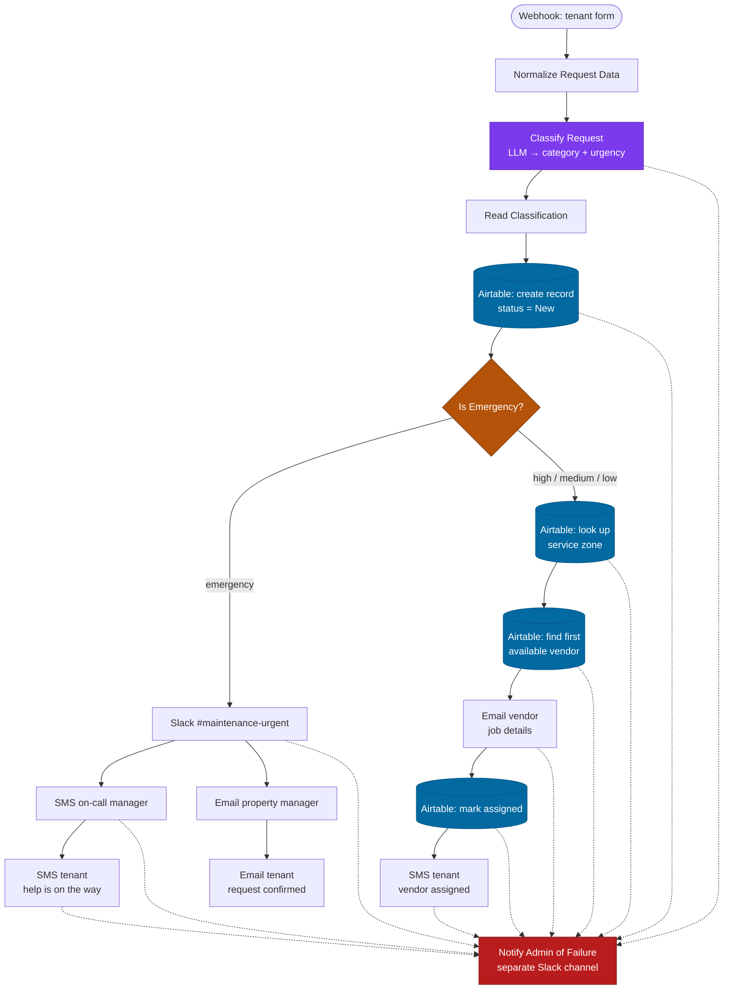

# AI Classification and Routing

An LLM reads a free-text maintenance request, classifies it by **category** and **urgency**, and the workflow routes it down a different path depending on what came back — emergency alerts on one branch, automated vendor matching on the other.

Built in n8n. The interesting part is not the classification; it is what happens around it.

---

## The problem

A tenant submits a maintenance request as free text: *"there's water coming through the ceiling in the bathroom."* Someone has to read that, decide it is plumbing, decide it is urgent, find a plumber who covers that property, and email them. Manual triage costs minutes per request and is inconsistent between whoever is on duty.

## The flow



<sub>Dotted lines are node error outputs. Every external call has one.</sub>

**Classification** uses the Information Extractor node against a strict JSON schema — `category` is one of five enum values, `urgency` one of four. Enums rather than free-form strings, because the next node branches on the exact value: a model that answers "quite urgent" instead of `high` breaks the routing silently.

The system prompt defines `emergency` by example — active flooding, no heat in freezing weather, exposed live wiring, gas smell — rather than leaving it to the model's judgment. Urgency is the field that decides whether someone gets woken up.

## Four things worth pointing out

**1. Routing is separated from classification.**
`Read Classification` sits between the extractor and everything downstream, and reads defensively:

```js
{{ $json.output ? $json.output.category : $json.category }}
```

The Information Extractor nests its result under `output`, but a retried or differently-parsed response can arrive flat. Handling both shapes in one place means the branch logic never has to care.

**2. Downstream nodes read by node name, not `$json`.**
Every reference is `$('Normalize Request Data').item.json.tenant_name` rather than `$json.tenant_name`. By the time the request reaches the vendor email, the item has passed through an LLM node and two Airtable nodes, each of which replaced the item shape entirely. Named references survive that; positional ones do not.

**3. The error channel is deliberately not the alert channel.**
`Notify Admin of Failure` posts to a different Slack channel than `#maintenance-urgent`. If the urgent-alert post fails, its own failure notice has to land somewhere that is not also broken.

**4. Every external call has an error output wired.**
Airtable, Slack, Twilio, Gmail and the extractor all use `onError: continueErrorOutput` with retries (3 tries, 5s apart). A failure produces an admin notification, not a stalled request and a tenant who never hears back.

## Emergency path redundancy

The emergency branch notifies over **two independent providers** — Twilio SMS and Gmail — rather than one. A single provider outage should not be the reason nobody was told about exposed live wiring.

## Setup

Four credentials, all in the n8n credential store: **OpenAI**, **Airtable** (personal access token), **Slack** (bot token), **Twilio**, **Gmail** (OAuth2).

Three Airtable tables in one base:

| Table | Columns |
|---|---|
| Requests | tenant_name, unit_number, description, contact_phone, contact_email, category, urgency, status, created_at, assigned_vendor |
| Properties | unit_number, service_zone |
| Vendors | vendor_name, vendor_email, category, service_zone, status |

Then import `workflows/tenant-maintenance-vendor-dispatch.json` and replace every `REPLACE_WITH_` placeholder — Airtable base and table IDs, Slack channel IDs, Twilio numbers, the property manager email, the vendor-accept domain, and each credential ID.

> No credentials, tokens, real phone numbers or real email addresses are committed. Every identifier in the export is a placeholder.

## Limitations

- Vendor matching takes the first available vendor for the category and zone (`limit: 1`). There is no load balancing, rotation, or cost comparison.
- The vendor accept link points at a handler that is out of scope for this workflow.
- The webhook is unauthenticated — fine behind a form provider that signs requests, but it should verify the signature before facing the open internet.
- Classification is not reviewed by a human. A misclassified emergency is downgraded silently; a confidence threshold with human escalation would be the next thing to add.
